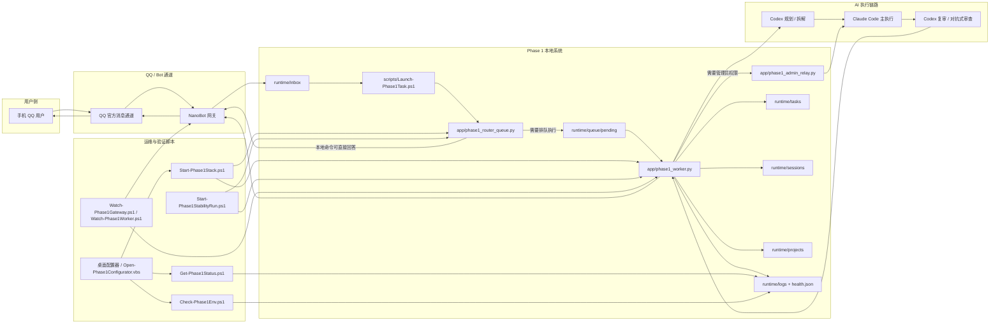
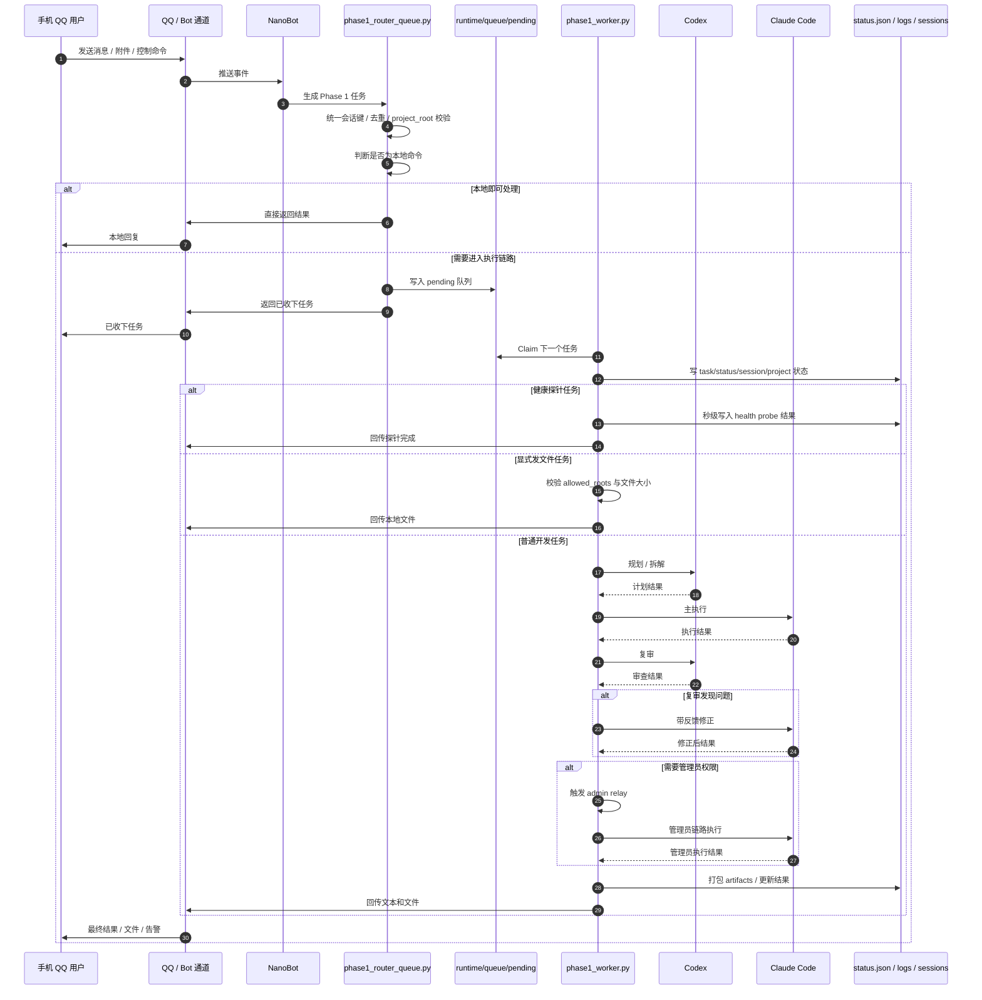
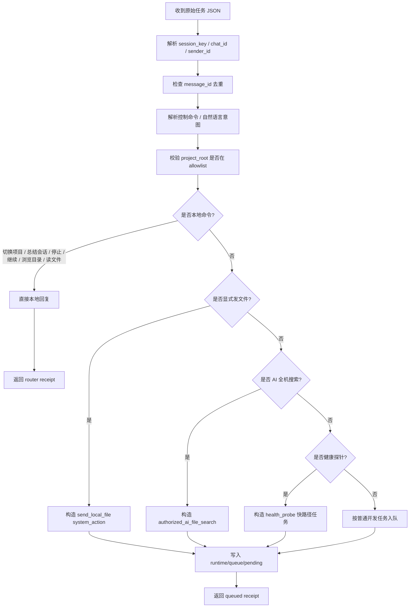
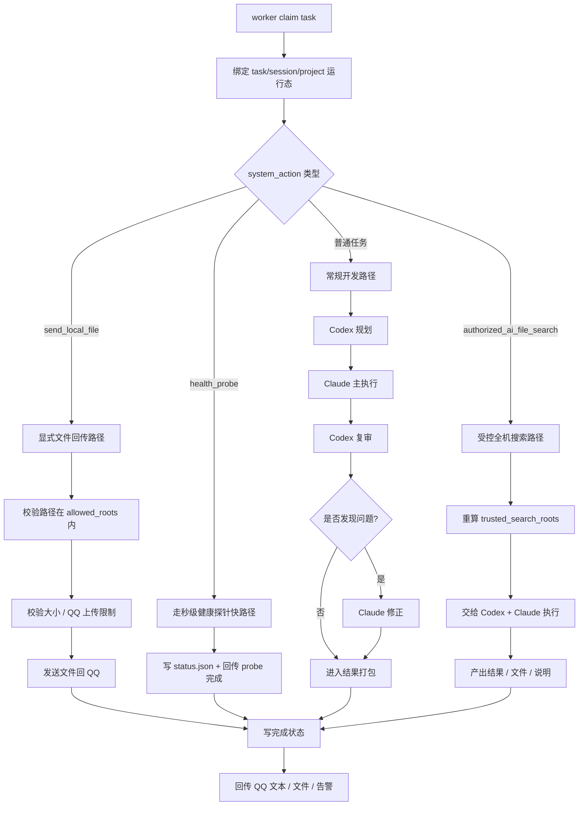
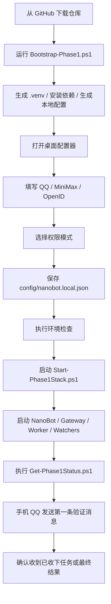
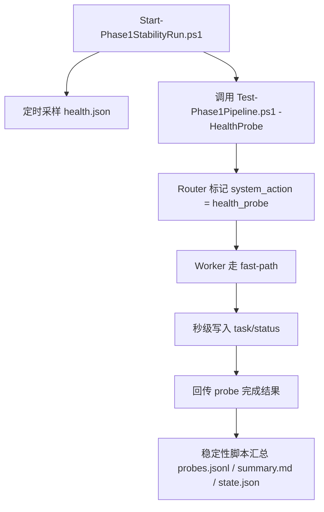

# Phase 1 架构与流程图

这份文档用 `GitHub 原生 Mermaid` 画出项目的核心结构。

优点是：

- 可以直接在 GitHub 页面渲染
- 你后续修改时只需要改 Markdown
- 不依赖第三方画图软件
- 适合比赛审阅、开源协作和后续版本迭代

## 1. 整体架构总览

## 2. 一条消息从手机进来到结果回传的链路

## 3. Router 的分流逻辑

## 4. Worker 的执行逻辑

## 5. 启动与部署流程

## 6. 稳定性与健康探针流程

## 7. 你后续修改这张图时最常改的地方

- 如果新增新的 `system_action`，改“Router 分流逻辑”和“Worker 执行逻辑”
- 如果新增新的 watcher / 自愈脚本，改“整体架构总览”
- 如果新增新的部署入口，改“启动与部署流程”
- 如果新增新的验证方案，改“稳定性与健康探针流程”

## 8. 推荐在 README 里怎么引用

可以直接在 README 文档列表里挂这个文件：

- `docs/PHASE1_ARCHITECTURE_FLOW_CN.md`

也可以在首页加一句：

“如果你想先看全局结构，请先读《Phase 1 架构与流程图》。”
