# Phase 1 GitHub 可安装发行版完整流程图

这份文档专门描述“用户从 GitHub 下载仓库，到本地安装、配置、启动，再到手机 QQ 发起任务并获得结果”的完整流程。

和已有的架构文档相比，这份图更偏：

- 公开发行版
- 可直接安装
- 用户视角 + 产品视角
- GitHub 审阅时一眼看懂全链路

## 完整流程图

```mermaid
flowchart TD

    A["用户打开 GitHub 仓库首页"] --> B["阅读 README<br/>确认这是可直接部署的公开发行版"]
    B --> C["选择获取代码<br/>git clone / Download ZIP"]
    C --> D["把项目放到稳定目录<br/>例如 D:\\YourFolder\\phase1_remote_dev_system"]

    D --> E["检查本机基础环境"]
    E --> E1["Windows 10 / 11"]
    E --> E2["PowerShell 5.1+"]
    E --> E3["Python 3.11 / 3.12 + venv"]
    E --> E4["Node.js 18+"]
    E --> E5["Rust 工具链"]
    E --> E6["Claude Code CLI 已登录"]
    E --> E7["Codex CLI 已登录"]
    E --> E8["QQ Bot 凭据可用"]

    E8 --> F["执行 Bootstrap-Phase1.ps1"]

    subgraph Init["初始化阶段"]
        F --> F1["创建 .venv"]
        F1 --> F2["安装 Python 依赖"]
        F2 --> F3["补齐公开版所需脚本依赖"]
        F3 --> F4["必要时安装 claude / codex CLI"]
        F4 --> F5["根据模板生成 config/nanobot.local.json"]
        F5 --> F6["准备 desktop-configurator 运行环境"]
    end

    F6 --> G{"用户如何配置?"}
    G -->|"方式 A"| H["双击 Open-Phase1Configurator.vbs"]
    G -->|"方式 B"| I["手动编辑 config/nanobot.local.json"]

    subgraph Configurator["桌面配置器阶段"]
        H --> H1["打开本地 Tauri 窗口<br/>不是浏览器页面"]
        H1 --> H2["填写 QQ App ID / Secret"]
        H2 --> H3["填写授权 QQ OpenID"]
        H3 --> H4["填写 MiniMax API Key"]
        H4 --> H5["选择权限模式"]
        H5 --> H6["工作区模式"]
        H5 --> H7["自定义目录模式"]
        H5 --> H8["整个计算机模式"]
        H6 --> H9["保存到 nanobot.local.json"]
        H7 --> H9
        H8 --> H9
        H9 --> H10["点击检查环境"]
        H10 --> H11["点击启动整套链路"]
        H11 --> H12["点击获取状态"]
    end

    subgraph ManualConfig["手动配置阶段"]
        I --> I1["把占位符替换成真实值"]
        I1 --> I2["确认默认工作区与 allowedRoots"]
        I2 --> I3["保存 nanobot.local.json"]
    end

    H12 --> J["系统进入启动阶段"]
    I3 --> J

    subgraph Startup["启动阶段"]
        J --> J1["执行 Start-Phase1Stack.ps1"]
        J1 --> J2["加载 Phase1-ConfigHelpers.ps1"]
        J2 --> J3["解析项目根目录与本地配置"]
        J3 --> J4["启动 NanoBot 网关"]
        J4 --> J5["启动 Phase1 Router / Launch 流程"]
        J5 --> J6["启动 Worker"]
        J6 --> J7["启动 Gateway / Worker Watchdog"]
        J7 --> J8["写入 runtime/health.json 与锁文件"]
    end

    J8 --> K["执行 Get-Phase1Status.ps1"]
    K --> K1["展示 gateway / worker / runtime 状态"]
    K1 --> K2{"状态正常?"}
    K2 -->|"否"| K3["执行 Check-Phase1Env.ps1"]
    K3 --> K4["定位缺失依赖 / 配置问题 / 通道问题"]
    K4 --> G
    K2 -->|"是"| L["手机 QQ 发送第一条验证消息"]

    subgraph Runtime["运行阶段：消息进入系统"]
        L --> L1["QQ 消息进入 QQ 官方通道"]
        L1 --> L2["NanoBot 接收消息事件"]
        L2 --> L3["生成原始任务 JSON"]
        L3 --> L4["Launch-Phase1Task.ps1 写入 runtime/inbox"]
        L4 --> L5["phase1_router_queue.py 读取任务"]
    end

    subgraph Router["Router 分流阶段"]
        L5 --> R1["统一 session_key / chat_id / sender_id"]
        R1 --> R2["检查 message_id 去重"]
        R2 --> R3["校验 project_root 是否在 allowlist"]
        R3 --> R4["识别控制命令 / 自然语言意图"]
        R4 --> R5{"任务类型?"}
        R5 -->|"本地命令"| R6["直接本地回复<br/>如切项目/看状态/读文件"]
        R5 -->|"显式发文件"| R7["构造 send_local_file"]
        R5 -->|"AI 全机搜索"| R8["构造 authorized_ai_file_search"]
        R5 -->|"健康探针"| R9["构造 health_probe"]
        R5 -->|"普通开发任务"| R10["写入 pending 队列"]
        R7 --> R10
        R8 --> R10
        R9 --> R10
    end

    R6 --> M["QQ 立即收到本地回复"]
    R10 --> N["Router 回传 queued receipt<br/>QQ 先收到“已收下任务”"]

    subgraph Worker["Worker 执行阶段"]
        N --> W1["phase1_worker.py claim pending task"]
        W1 --> W2["绑定 task / session / project 状态"]
        W2 --> W3["写 runtime/tasks/status.json"]
        W3 --> W4{"system_action 类型?"}

        W4 -->|"health_probe"| W5["走秒级快路径"]
        W5 --> W6["快速写状态并回传 probe 完成"]

        W4 -->|"send_local_file"| W7["校验 path 是否在 allowed_roots"]
        W7 --> W8["校验大小与 QQ 上传限制"]
        W8 --> W9["直接回传本地文件到 QQ"]

        W4 -->|"authorized_ai_file_search"| W10["重算 trusted_search_roots"]
        W10 --> W11["把受控搜索范围传给 AI 执行链路"]

        W4 -->|"普通开发任务"| W12["准备 batch / recent context / prompt"]

        W11 --> W13["Codex 先做规划与拆解"]
        W12 --> W13
        W13 --> W14["Claude Code 主执行"]
        W14 --> W15["Codex 复审 / 对抗式审查"]
        W15 --> W16{"复审发现问题?"}
        W16 -->|"是"| W17["Claude 按审查反馈修正"]
        W17 --> W18["Codex 二次复审"]
        W16 -->|"否"| W19["进入结果打包"]
        W18 --> W19

        W19 --> W20{"是否需要管理员权限?"}
        W20 -->|"是"| W21["触发 admin relay"]
        W21 --> W22["管理员链路执行并返回结果"]
        W20 -->|"否"| W23["继续普通执行结果收尾"]
        W22 --> W24["合并最终结果"]
        W23 --> W24

        W24 --> W25["打包 artifacts / 文件 / 摘要"]
        W25 --> W26["更新 sessions / projects / logs / health"]
        W26 --> W27["向 QQ 回传文本结果"]
        W27 --> W28["必要时继续回传文件"]
    end

    W6 --> O["手机 QQ 收到健康探针完成"]
    W9 --> P["手机 QQ 收到文件"]
    W28 --> Q["手机 QQ 收到最终结果 / 文件 / 告警"]

    subgraph OpsAndSafety["产品化与安全收口"]
        Q --> S1["用户可随时执行 Get-Phase1Status.ps1"]
        S1 --> S2["查看 gateway / worker / queue / health"]
        S2 --> S3{"出现异常?"}
        S3 -->|"是"| S4["执行 New-Phase1DiagnosticBundle.ps1"]
        S4 --> S5["导出脱敏诊断包"]
        S5 --> S6["用 Check-Phase1Env.ps1 或日志定位问题"]
        S3 -->|"否"| S7["继续日常远程使用"]

        S7 --> S8["如需发布前验证"]
        S8 --> S9["执行 Start-Phase1StabilityRun.ps1"]
        S9 --> S10["定期采样 health.json"]
        S10 --> S11["调用 Test-Phase1Pipeline.ps1 -HealthProbe"]
        S11 --> S12["汇总 summary.md / state.json / probes.jsonl"]
        S12 --> S13["确认 GitHub 发行版具备可安装、可运行、可验证闭环"]
    end
```

## 这张图最适合怎么用

如果你要放到 GitHub 展示，我建议这样用：

1. `README` 首页只放一张相对简洁的总览图  
2. 把这份文件作为“完整发行版流程图”挂到 `docs/`  
3. 比赛答辩或项目介绍时，优先讲这张图，因为它最能体现你不是只做了一个 demo，而是做了一套可安装、可配置、可运行、可验证的产品

## 一句话说明

这套 GitHub 公开版的核心价值，不是“接了几个模型”，而是把 `下载 -> 初始化 -> 配置 -> 启动 -> 远程触发 -> 本地执行 -> 结果回传 -> 状态诊断 -> 稳定性验证` 全部收成了一条可直接部署的产品链路。
